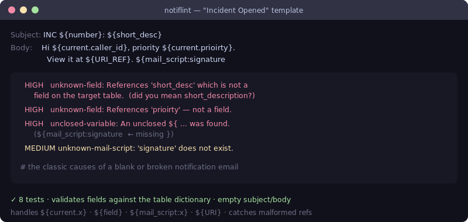

# notiflint — ServiceNow notification linter

[](https://github.com/JCreatesGH/sn-notif-lint/actions)
[](https://www.python.org/)
[](LICENSE)

Stop shipping blank or broken notification emails. `notiflint` scans ServiceNow notification/email templates for variable references that won't resolve — misspelled fields, unclosed `${`, missing mail scripts — before they reach an inbox.



## Install

```bash
pip install notiflint
```

## Use it

```python
from notiflint import lint_template, Template

tpl = Template(
    subject="INC ${number}: ${short_desc}",
    body="Hi ${current.caller_id}, priority ${current.prioirty}. ${mail_script:signature",
)

valid_fields = {"number", "short_description", "caller_id", "priority"}  # from the dictionary
mail_scripts = {"greeting"}

for f in lint_template(tpl, valid_fields, mail_scripts):
    print(f.severity, f.rule, f.message)
```

## What it catches

| Severity | Rule | Why |
|----------|------|-----|
| HIGH | `unknown-field` | `${short_desc}` / `${current.prioirty}` typos that render blank |
| HIGH | `empty-subject` / `empty-body` | the template would send nothing |
| HIGH | `unclosed-variable` | a stray `${` with no closing `}` |
| MEDIUM | `unknown-mail-script` | `${mail_script:x}` where `x` doesn't exist |
| MEDIUM | `malformed-ref` | unrecognizable `${…}` content |

It understands the ServiceNow reference styles — `${current.field}`, `${field}`, `${mail_script:name}`, `${URI}` / `${URI_REF}`, and `sys_*` / event params — and only validates the ones that should map to a real field.

## Development

```bash
python -m pytest -q   # 8 tests
```

## License

MIT
